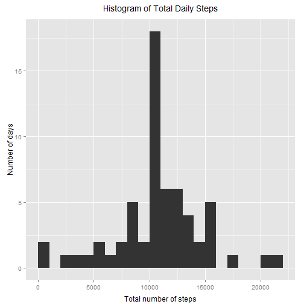
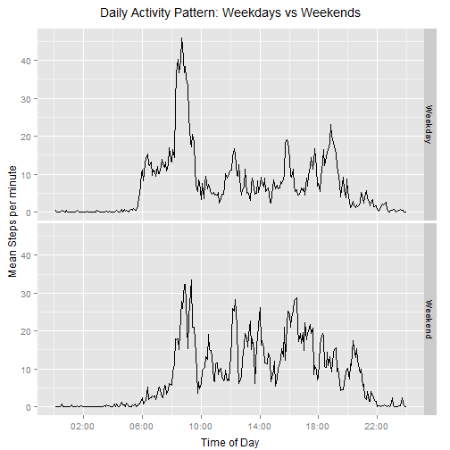

  
## Reproducible Research: Peer Assessment 1
=================================
  


A quick note: Please be aware that this (and other submissions) may end up with slightly different plots and conclusions to your own. This is because the instructions are not wholly unambiguous. For example, [there is some debate](https://class.coursera.org/repdata-008/forum/thread?thread_id=55) over what is meant by "ignoring" NAs in this assignment - I have taken it to mean removing NAs (na.rm=TRUE) when computing means/sums in the first part, in order to compare this approach with the later imputation method. But both are - statistically speaking - pretty terrible ideas with the NAs distributed as they are here, so if you come across someone who instead removes all the NAs in advance for part 1 - a much more justifiable approach, albeit not what I think the instructions strictly ask us to do - I would suggest not downgrading for that. Also, figure 4 - the panel plot - will be different depending on the system it's constructed in (I used ggplot, the example is lattice) and whether the panels are stacked or presented side-by-side. The example plot shows them stacked, which better displays the change in start time. I've chosen instead to display them side-by-side as I think the easier comparison of step rates (y-axis) is more informative and useful. I've also scaled steps to show "Mean steps per *minute*", rather than total steps, or per 5-minute-interval, again because that seems to me to be a more meaningful and generalisable statistic.

I've also used inline R script to answer some of the specific questions. That is, I've calculated a statistic such as mean daily steps, then called it in a non-code section (within a sentence). This is instead of printing the value to the console from the code sections, as others may have done.
  


### Loading and Processing the data
  


Load useful libraries (loading text other than warnings suppressed for clarity):

```r
suppressMessages(library(plyr)) # For working with tidy data frames
suppressMessages(library(dplyr)) # For working with tidy data frames
suppressMessages(library(scales)) # For plotting 
suppressMessages(library(ggplot2)) # For plotting
```
  


Clear and set workspace, load the data:

```r
rm(list = ls())
wd<-"C:/Users/Iain/Documents/GitHub/RepData_PeerAssessment1"
filename<-"/activity.csv"
setwd(wd)
df<-read.csv(paste(wd,filename,sep=""))
```
  


Format the date/interval variables and prepare for dplyr:

```r
hours<-df$interval %/% 100
mins<-df$interval %% 100
time<-hours+mins/60 # Convert to hours. Never actually used, since this gets converted to a factor anyhow, but this labelling is less confusing for me when visually inspecting the data!
df$timefactor<-as.factor(time) # Store the time as a factor for analysis
tidydf<-tbl_df(df) # Creates tidy data frame for use with dplyr
```
  


Glance at the formatted tidy data frame:

```r
head(tidydf)
```

```
## Source: local data frame [6 x 4]
## 
##   steps       date interval         timefactor
## 1    NA 2012-10-01        0                  0
## 2    NA 2012-10-01        5 0.0833333333333333
## 3    NA 2012-10-01       10  0.166666666666667
## 4    NA 2012-10-01       15               0.25
## 5    NA 2012-10-01       20  0.333333333333333
## 6    NA 2012-10-01       25  0.416666666666667
```
  
  


### What is the mean total number of steps taken per day?
  


R code to generate required plot and variables:

```r
grouped_table <- group_by(tidydf[1:2],date) # Group steps by date
plot1_data <- summarise_each(grouped_table,funs(sum(., na.rm=TRUE))) # Total steps per day

#Create histogram using ggplot2 package, choosing pretty bin size:
xbreaks <- pretty(range(plot1_data$steps,na.rm=TRUE),25)
fig1 <- qplot(steps,data=plot1_data,breaks=xbreaks) 

fig1 <- fig1 + labs(title = "Histogram of Total Daily Steps") #Adjust plot
fig1 <- fig1 + labs(x = "Total number of steps")
fig1 <- fig1 + labs(y = "Number of days")
fig1 <- fig1 + theme(axis.title.x = element_text(vjust=-0.35),
     axis.title.y = element_text(vjust=0.5),
     plot.title = element_text(vjust=2))

meansteps <- mean(plot1_data$steps,na.rm=T) # Calculate mean daily steps
mediansteps <- median(plot1_data$steps,na.rm=T) # Calculate median daily steps

meansteps_nice <- sprintf("%.1f", meansteps) # For nicer printing, create 
# formatted string for the mean value with 1 decimal place.
```
  


Histogram of total daily steps:

```r
print(fig1) # Print out Histogram of Total Daily Steps:
```

 
  


Using inline R script to print variables directly:  

The mean number of daily steps is 9354.2.  
The median number of daily steps is 10395.
  
  


### What is the average daily activity pattern?
  


R code to generate required plot and variables:

```r
grouped_table <- group_by(tidydf[c(1,4)],timefactor) # Group steps by time factor
plot2_data <- summarise_each(grouped_table,funs(mean(., na.rm = TRUE))) # Mean steps per interval
plot2_data$time <- ISOdate(2001, 1, 1, 0, tz = "GMT") + as.numeric(plot2_data$timefactor)*5*60 # Factor no good for labeling x-axis, so generate a POSIXct object

# Create histogram using ggplot2 package:
fig2 <- qplot(time,steps/5,data=plot2_data,geom="line")
# Note conversion to steps per minute for easier comparison with other data

fig2 <- fig2 + labs(title = "Average Daily Activity Pattern") #Adjust plot
fig2 <- fig2 + labs(x = "Time of Day")
fig2 <- fig2 + labs(y = "Mean Steps per minute")
fig2 <- fig2 + theme(axis.title.x = element_text(vjust=-0.35),
     axis.title.y = element_text(vjust=1),
     plot.title = element_text(vjust=2))
fig2 <- fig2 + scale_x_datetime(breaks = date_breaks("4 hour"),
                                labels = date_format("%H:%M"))

max_steprate_nice <- sprintf("%.1f", max(plot2_data$steps)/5)
max_interval_start <- strftime(plot2_data$time[which.max(plot2_data$steps)],format="%H:%M",tz="GMT")
max_interval_end <- strftime(plot2_data$time[which.max(plot2_data$steps)+1],format="%H:%M",tz="GMT")
```
  


Average daily activity pattern:

```r
print(fig2) # Print out Time Series of average steps per minute:
```

 
  
  


The interval with the greatest number of daily steps is between 08:40 and 08:45, with a mean step rate of 41.2 steps per minute. Now technically the question asks for greatest total number of steps, which missing values might cause to differ from the (more meaningful!) greatest step rate. So quickly check it:
  


```r
plot2_check <- summarise_each(grouped_table,funs(sum(., na.rm = TRUE))) # Total steps per interval
max_steptotal <- max(plot2_check$steps,na.rm=TRUE)
maxtotal_interval_start <- strftime(plot2_data$time[which.max(plot2_check$steps)],format="%H:%M",tz="GMT")
maxtotal_interval_end <- strftime(plot2_data$time[which.max(plot2_check$steps)+1],format="%H:%M",tz="GMT")
```


The interval between 08:40 and 08:45 included the greatest total number of steps: 10927.
  
  


### Imputing missing values
  


R code to count NAs:

```r
num_NAs <- sum(is.na(df$steps))
```
  


The total number of missing step values is 2304.  
  


R code to impute new NAs. Overall we are adopting an approach similar to that of [mean imputation](http://en.wikipedia.org/wiki/Imputation_(statistics)), but to reintroduce some of the variance that loses we're going to randomly generate the data from a distribution around the mean that we choose (specifically, we'll use poisson):

```r
# Logic: Steps in any given interval is an integer >=0, so a poisson distribution
# seems a fair way of imputing new data (of course the reality is more 
# complicated, with a greater number of zeros, but we're staying simple).
# We already have average step rates for each interval, across days. It might be 
# nice to construct a smoothed version of the step data to get local averages
# (i.e. the average steps taken in preceding/following intervals) - but visual
# inspection shows NAs occur in large clusters, so neighbouring data won't be
# much help. Finally, we'd also like to use a modifier based on the activity in
# that whole day, so that NA values are affected by the day they occur, as well 
# as the time - but our visual inspection also reveals that days tend to have 
# have full data or no data at all so that approach won't buy us anything either.
# So we'll keep it simple and just use the interval mean. 

tidydf$intervalmean <- plot2_data$steps[tidydf$timefactor] 
# Mean steps associated with each interval, mapped to each observation

tidydf$imputed <- rpois(nrow(tidydf),tidydf$intervalmean)
# Generate poisson distributed data for every row

tidydf$imputed[!is.na(tidydf$steps)] <- tidydf$steps[!is.na(tidydf$steps)]
# Replace this imputed data with the original if it exists (done this way to
# avoid writing over the true data in $steps). We now have the new dataset...

dfnew<-tidydf[c(6,2,3,4)] #...with $imputed replacing $steps:

summary(dfnew)
```

```
##     imputed               date          interval     
##  Min.   :  0.00   2012-10-01:  288   Min.   :   0.0  
##  1st Qu.:  0.00   2012-10-02:  288   1st Qu.: 588.8  
##  Median :  0.00   2012-10-03:  288   Median :1177.5  
##  Mean   : 37.39   2012-10-04:  288   Mean   :1177.5  
##  3rd Qu.: 27.00   2012-10-05:  288   3rd Qu.:1766.2  
##  Max.   :806.00   2012-10-06:  288   Max.   :2355.0  
##                   (Other)   :15840                   
##               timefactor   
##  0                 :   61  
##  0.0833333333333333:   61  
##  0.166666666666667 :   61  
##  0.25              :   61  
##  0.333333333333333 :   61  
##  0.416666666666667 :   61  
##  (Other)           :17202
```
  


Now, if we repeat the histogram/mean/median calculation from earlier:

```r
grouped_table <- group_by(dfnew[1:2],date) # Group steps by date
plot3_data <- summarise_each(grouped_table,funs(sum(., na.rm=TRUE))) # Total steps per day

#Create histogram using ggplot2 package, choosing pretty bin size:
xbreaks <- pretty(range(plot3_data$imputed,na.rm=TRUE),25)
fig3 <- qplot(imputed,data=plot3_data,breaks=xbreaks) 

fig3 <- fig3 + labs(title = "Histogram of Total Daily Steps") #Adjust plot
fig3 <- fig3 + labs(x = "Total number of steps")
fig3 <- fig3 + labs(y = "Number of days")
fig3 <- fig3 + theme(axis.title.x = element_text(vjust=-0.35),
     axis.title.y = element_text(vjust=0.5),
     plot.title = element_text(vjust=2))

meansteps <- mean(plot3_data$imputed,na.rm=TRUE) # Calculate mean daily steps
mediansteps <- median(plot3_data$imputed,na.rm=TRUE) # Calculate median daily steps

meansteps_nice <- sprintf("%.1f", meansteps) # For nicer printing, create 
# formatted string for the mean value with 1 decimal place.
```
  


Histogram of total daily steps (after NAs imputed with new data):

```r
print(fig3) # Print out Histogram of Total Daily Steps:
```

 
  


The mean number of daily steps is 10767.9.  
The median number of daily steps is 10765.
  


We can see that the mean has moved higher, very close to the median. The histogram shows us why. When we originally discarded the NA values from the analysis, that meant we ended up with some days (8 in fact) that had a total step count of zero, and that dragged the mean (but not the median) down. But what was actually going on is that these days had all or nearly all missing values, not zeros. So, when we imputed new estimates for these missing values, based on the interval averages we saw *elsewhere* in the dataset, they ended up giving each of those days a new nonzero number of steps - and you can see 8 days have shifted from the 0 bin in the histogram to the average bin. 

Note too, that this highlights a limitation of the imputation procedure (actually the data): Because we have no information about how active these 8 days were compared to the others (we only used interval means remember, as the missing value pattern precluded using local or daily means), we ended up giving each of the days a number of steps very close to the global mean. In other words, we haven't accounted for any of the between-day variance. 

Now, if there were some more intervals available on each of those days, we could compute daily step rates based on the the step rate *within those intervals*, taking into account the average rate in that interval. With a decent number of non-NA intervals in each day this imputation procedure would become much more accurate than simply using the mean interval procedure alone. But we simply don't have sufficient data for that, so the best procedure would actually be to remove the 8 days with missing data I should think. I leave this imperfect imputation as is, since it illustrates the limitations of the data set quite well. But don't do this in real life! Imputation only works better than discarding if you can infer sufficient information about the values you are imputing, and the structure of the data sometimes precludes this (as in this case). And of course it can be much worse if you use an overly simple method like we have, and fail to take some sources of variance into account. It's clear from the histograms that we've ended up artificially reducing the variance of our data. 
  


### Are there differences in activity patterns between weekdays and weekends?
  

Let's construct a new factor variable in our data frame:

```r
#Get the day name for each observation:
days <- weekdays(as.Date(dfnew$date))

# Create day factor variable, initially set all values to "Weekday":
dfnew$dayfactor <- rep("Weekday",nrow(dfnew))

# Change Saturdays and Sundays to "Weekend" and convert to factor:
dfnew$dayfactor[days=="Saturday"|days=="Sunday"] <- "Weekend"
dfnew$dayfactor <- as.factor(dfnew$dayfactor)

# Check we have roughly the right proportions of each factor:
levels(dfnew$dayfactor)
```

```
## [1] "Weekday" "Weekend"
```

```r
summary(dfnew$dayfactor)
```

```
## Weekday Weekend 
##   12960    4608
```
  


Create new daily activity pattern plots, this time separately for Weekdays/Weekends:

```r
grouped_table <- group_by(dfnew[,c(1,4,5)],timefactor,dayfactor) # Group steps by time factor
plot4_data <- summarise_each(grouped_table,funs(sum(., na.rm=TRUE))) # Total steps per day

plot4_data$time <- ISOdate(2001, 1, 1, 0, tz = "GMT") + as.numeric(plot4_data$timefactor)*5*60 # Factor no good for labeling x-axis, so generate a POSIXct object

# Create histogram using ggplot2 package:
fig4 <- qplot(time,imputed/5,data=plot4_data,geom="line",facets=.~dayfactor)
# Note conversion to steps per minute for easier comparison with other data

fig4 <- fig4 + labs(title = "Daily Activity Pattern: Weekdays vs Weekends") #Adjust plot
fig4 <- fig4 + labs(x = "Time of Day")
fig4 <- fig4 + labs(y = "Mean Steps per minute")
fig4 <- fig4 + theme(axis.title.x = element_text(vjust=-0.35),
     axis.title.y = element_text(vjust=1),
     plot.title = element_text(vjust=2))
fig4 <- fig4 + scale_x_datetime(breaks = date_breaks("4 hour"),
                                labels = date_format("%H:%M"))
```
  


Time series showing Daily Activity Pattern for Weekdays vs Weekends (after NAs imputed with new data):

```r
print(fig4) # Print out Daily Activity Patterns for Weekdays/Weekends
```

 
  


The plots are presented side-by-side for easy comparison of y-values (step rates). From this, it's immediately clear that:
- There is less activity overall during weekends
- Activity begins later on weekends, generally around 8am instead of 6am. Lie in!
- The peak at 8.40am is much smaller in the weekend data, suggesting it's likely part of a commute rarely taken during the weekend.
- Activity generally appears to be much more homogenous during weekends, i.e. mean step rates are similar throughout the day. Be careful though, since we're looking at averaged data. It may simply be that weekdays are more predictable, i.e. the peaks and troughs occur at the same time each day and thus show up on the average plot. Activity could be just as 'spiky' during the weekends, but if it's less tightly scheduled the averaging would smooth it out. So we can't actually say too much about the distribution of activity across time without also plotting a measure of variance across days.
  
  


This concludes our tour through this dataset. I hope you enjoyed reading about these two separate terrible approaches to dealing with missing data.


